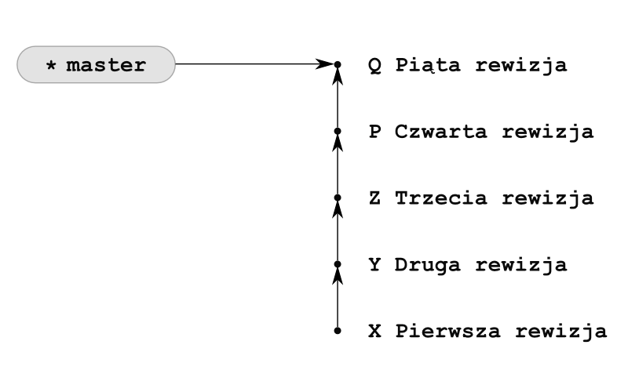
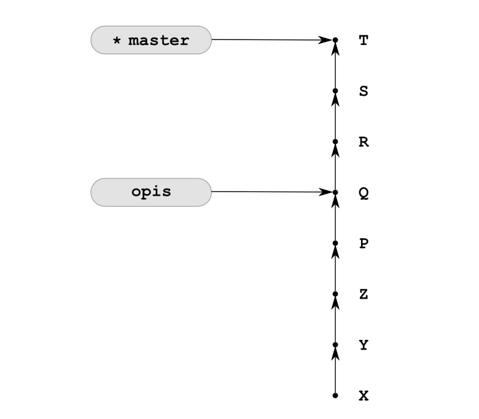
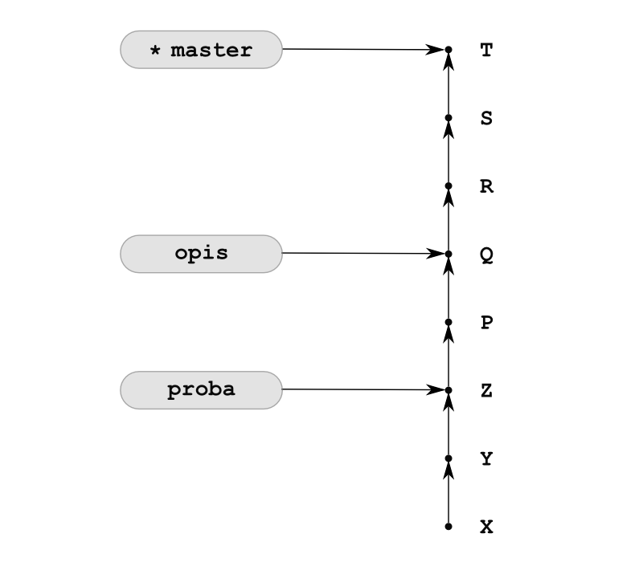
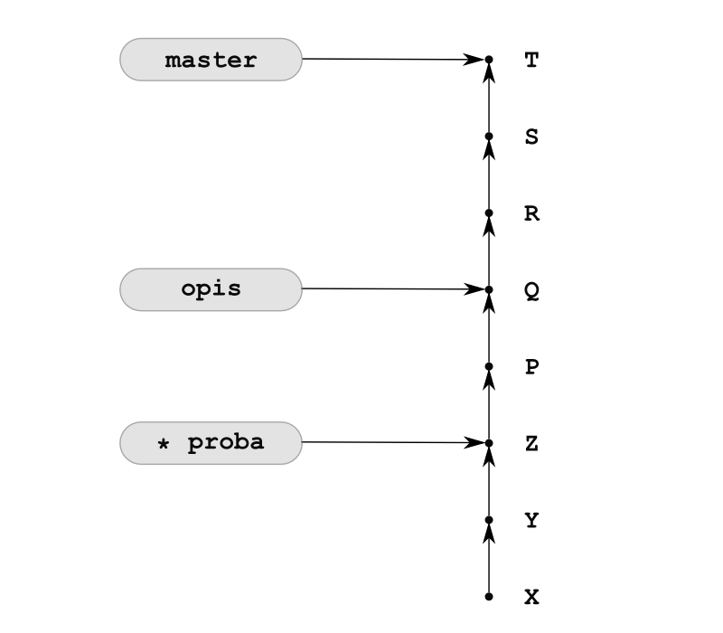
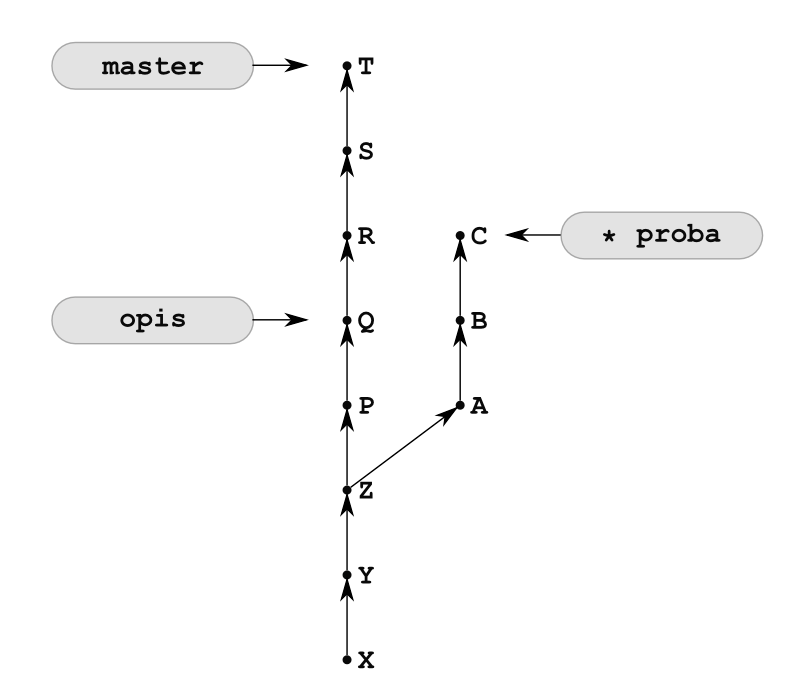
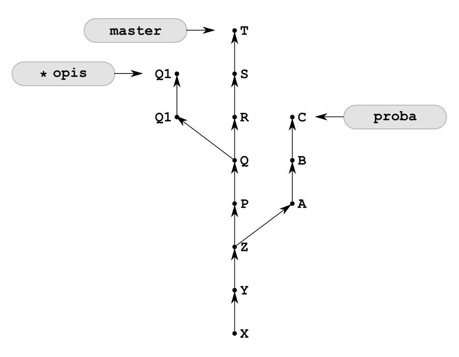
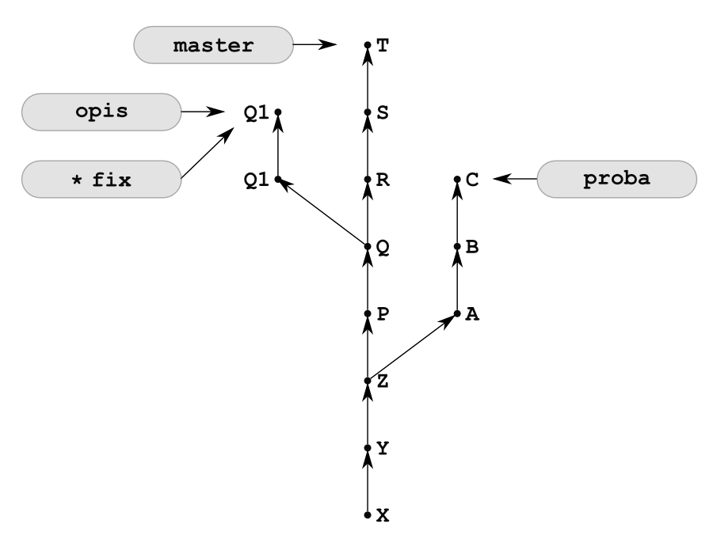
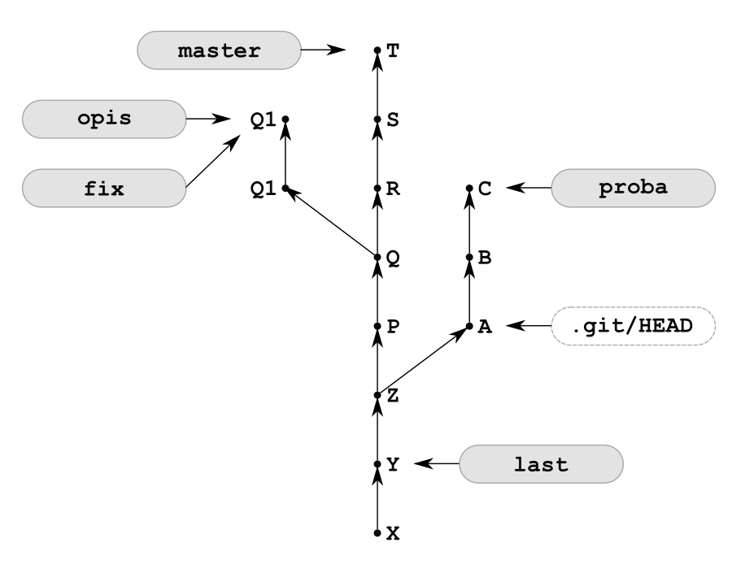

# GIT commit — dodawanie katalogów, modyfikacja, zmiana nazwy, usuwanie plików

Git porównuje wasze zmiany linia po linii w plikach tekstowych, tzn. jest w stanie wykryć zmiany (dodanie, usuwanie
całych linii).

Gdy zakomitujemy zmiany git poinformuje nas o dodanych liniach w pliku.

Gdy zmienimy nazwę pliku, git będzie twierdził, że usunęliśmy jeden plik,a dodaliśmy drugi. By przeprowadzić zmiany,
tak jak twierdzi git, musimy użyć komendy:

```bash
git mv pierwszy.txt lorem-ipsum.txt<Enter>
git status<Enter>
On branch master
Changes to be committed:
 (use "git reset HEAD <file>..." to unstage)

	renamed:    pierwszy.txt -> lorem-ipsum.txt
```

W podobny sposób możemy jasno definiować usunięcie pliku:

```bash
git rm <nazwa pliku>
```

Co, gdy chcemy dodać cały katalog (razem ze znajdującymi się w nim plikami)? Tym samym poleceniem, co normalne dodawanie
plików git add. Nie musicie w takim przypadku dodawać każdego pliku w podkatalogu oddzielnie.

Utwórzmy podkatalog "podkatalog", a w nim dwa pliki a.txt b.txt (puste) i dodajmy samą nazwę podkatalogu:

```bash
mkdir podkatalog<Enter>
cd podkatalog<Enter>
touch a.txt b.txt<Enter>
cd ..<Enter>
git add podkatalog<Enter>
git commit -m "dodano podkatalog"
[master 92a1c03] dodano podkatalog
 2 files changed, 0 insertions(+), 0 deletions(-)
 create mode 100644 podkatalog/a.txt
 create mode 100644 podkatalog/b.txt
```

Jak widać, git dodał 2 pliki wewnątrz katalogu — co ważne, nie dodał bezpośrednio katalogu "podkatalog". Dzieje się tak
dlatego, że GIT nie śledzi samych podkatalogów, jedynie wnioskuje ich obecność na podstawie ścieżek plików. Dlatego nie
może do repozytorium dodać pustego katalogu!

# GIT — Przywracanie plików, usuwanie z listy do dodania (staging)

Co zrobić w momencie, gdy popełniliśmy błąd? Np. usunęliśmy przypadkowo plik, który był bardzo potrzebny, albo
dokonaliśmy w pliku zmian, które chcemy cofnąć. Rozwiązanie zależy od momentu, do którego chcemy się cofnąć.

Przydatne polecenia:

```bash
git checkout <nazwa pliku>
```

Powyższe polecenie `checkout` przywraca stan pliku, który jest zapisany w repozytorium ostatnim commitem.

```bash
git reset HEAD <nazwa pliku>
```

To polecenie usuwa z

# II. Repozytoria zrozgałęzieniami

## Tworzenie i usuwanie gałęzi

> Rozważania zawarte w części II dotyczą pojedynczego repozytorium. Gałęzie zawarte w repozytorium, w którym pracujemy,
> określamy przymiotnikiem „lokalne”.

### Gałęzie to wskaźniki rewizji

Git optymalizuje zarządzanie pod kątem obsługi gałęzi. **Gałęzie Gita są wskaźnikami rewizji**. Tworzenie i usuwanie
gałęzi sprowadza się do operowania skrótami `SHA-1`. Utworzenie gałęzi to utworzenie pliku tekstowego zawierającego
skrót `SHA-1.`

### Gałąź master

Domyślnie w nowym repozytorium utworzonym poleceniem:

```bash
git init

```

po wykonaniu pierwszej rewizji tworzona jest jedna gałąź o nazwie master. Wydając polecenie:

```bash
git branch
```

Wydruk będzie zawierał informację:

```bash
* master
```

Gwiazdka informuje, że jest to gałąź, na której się obecnie znajdujemy.

Rewizje dodajemy poleceniami:

```bash
git add -A
git commit –m "Pierwsza rewizja"

```

Polecenie:

```bash
git status –sb

```

wyświetla skróconą informację o plikach repozytorium oraz nazwę gałęzi bieżącej.

Za każdym razem, gdy tworzymy rewizję, wskaźnik bieżącej gałęzi jest przesuwany do ostatniej utworzonej rewizji. Po
dodaniu kolejnych rewizji repozytorium będzie wyglądało tak jak na rysunku:



Rys. Repozytorium po wykonaniu pięciu rewizji.

Wskaźnik master to skrót `SHA-1` wskazywanej rewizji. Jest on zapisywany w pliku `.git/refs/heads/master`.
Plik `.git/refs/heads/master` dla repozytorium z rysunku będzie zawierał tekst Q.

> Na rysunku litery X, Y, Z, P oraz Q symbolizują skróty `SHA-1` rewizji.

### Tworzenie gałęzi

Do tworzenia gałęzi służy polecenie:

```bash
git branch name-new-branch
```

Jeśli w repozytorium z rysunku powyżej wydamy komendę:

```bash
git branch opis
```

spowoduje ona utworzenie nowej gałęzi o nazwie `opis`. Repozytorium będzie teraz wyglądało tak jak na rysunku poniżej


W folderze `.git` pojawi się plik `.git/refs/heads/opis` zawierający wartość `SHA-1` rewizji piątej.

Sprawdźmy gałęzie repozytorium. Polecenie:

```bash
git branch
```

zwróci tym razem wydruk:

```bash
* master
  opis
```

W repozytorium znajdują się dwie gałęzie. Bieżącą gałęzią jest gałąź `master`. Informacja o bieżącej gałęzi jest
zapisywana w pliku `.git/HEAD`. Jeśli bieżącą gałęzią jest gałąź `master`, to w pliku `HEAD` znajdziemy wpis:

```text
ref: refs/heads/master
```

### Dodawanie rewizji w bieżącej gałęzi

Jeśli teraz utworzymy nową rewizję. Gałąź bieżąca, czyli `master`, zostanie przesunięta na dodaną rewizję, a
gałąź `opis` pozostanie niezmieniona. Nowe rewizje są automatycznie dodawane do bieżącej gałęzi, w tym przypadku
do `master`.



### Tworzenie gałęzi wskazujących dowolną rewizję

Gałęzie możemy tworzyć, wskazując dowolną rewizję:

```bash
git branch nazwa-galezi SHA-1
```

Np.:

```bash
git branch proba Z
```



W folderze `.git` pojawi się plik `.git/refs/heads/proba` zawierający wartość `SHA-1` rewizji oznaczonej na rysunku
symbolem `Z`. Gałąź bieżąca nie ulegnie zmianie:

```bash
git branch
```

Wydruk będzie następujący:

```text
* master
  opis
  proba
```

Porządek gałęzi na powyższym wydruku jest alfabetyczny.

### Przełączanie gałęzi

Do zmiany gałęzi bieżącej służy komenda:

```bash
git checkout nazwa-galezi
```

Po wydaniu tej komendy bieżącą gałęzią stanie się gałąź o podanej nazwie, a pliki w obszarze roboczym przyjmą postać z
ostatniej rewizji w tej gałęzi.

> W początkowym okresie nauki komendę przełączania gałęzi najlepiej wydawać wyłącznie wtedy, gdy wszystkie pliki są
> aktualne (tj. gdy polecenie `git status –s` zwraca pusty wynik).


Po wydaniu komendy:

```bash
git checkout proba
```

pliki obszaru roboczego będą odpowiadały stanowi z rewizji `Z`. Ponadto polecenie:

```bash
git branch
```

zwróci wydruk:

```text
  master
  opis
* proba
```

Gwiazdka przy gałęzi `proba` informuje, że jest to gałąź bieżąca. W pliku `.git/HEAD` znajdziemy wpis:

```text
ref: refs/heads/proba
```



Wszystkie następne rewizje trafią do gałęzi `proba`:



Przejdźmy na gałąź `opis`:

```bash
git checkout opis
```

i dodajmy rewizje Q1 i Q2.



### Tworzenie i przełączanie gałęzi

Operację tworzenia i przełączania gałęzi możemy wykonać jednym poleceniem:

```bash
git checkout –b nazwa-galezi
```

Jeśli w repozytorium w stanie z rysunku powyżej wydamy komendę:

```bash
git checkout –b fix
```

to w repozytorium pojawi się gałąź `fix` i będzie to gałąź bieżąca.



Nowo utworzona gałąź może wskazywać dowolną rewizję. Służy do tego polecenie:

```bash
git checkout –b nazwa-galezi SHA-1
```

W celu utworzenia gałęzi last wskazującej rewizję Y należy wydać komendę:

```bash
git checkout –b last Y
```


### Stan detached HEAD

Jeśli pliki z obszaru roboczego przywrócimy do stanu z konkretnej rewizji, posługując się jej skrótem `SHA-1`,

```bash
git checkout SHA-1
```

wówczas repozytorium będzie znajdowało się w stanie określanym w dokumentacji terminem *detached HEAD*. W tym momencie
żadna gałąź nie jest gałęzią bieżącą. W pliku `.git/HEAD` zapisany jest skrót `SHA-1` konkretnej rewizji, a nie nazwa
symboliczna gałęzi `(np. ref: refs/heads/master).`

Jeśli w repozytorium z rysunku powyżej wydamy komendę:

```bash
git checkout A
```

wówczas repozytorium przyjmie stan z rysunku:



Zwróć uwagę na brak gwiazdki na rysunku.

Pliki w obszarze roboczym będą odpowiadały rewizji `A`, a w pliku `.git/HEAD` zapisany będzie skrót `SHA-1` rewizji `A`.

Polecenie:

```bash
git branch
```

zwróci wynik:

```text
* (no branch)
  fix
  last
  master
  opis
  proba
```

W takim stanie najlepiej nie wprowadzać żadnych modyfikacji w repozytorium (tj. nie tworzyć nowych rewizji), gdyż można
je utracić.

Co się stanie, jeśli wykonamy nową rewizję? W repozytorium pojawi się rewizja, do której nie można dotrzeć, stosując
gałąź. Rewizja ta zostanie dodana jako dziecko rewizji wskazanej przez `HEAD`. Jeśli w repozytorium z rysunku 13.13
wykonamy nową rewizję D, postać repozytorium będzie taka jak na rysunku 13.14.

