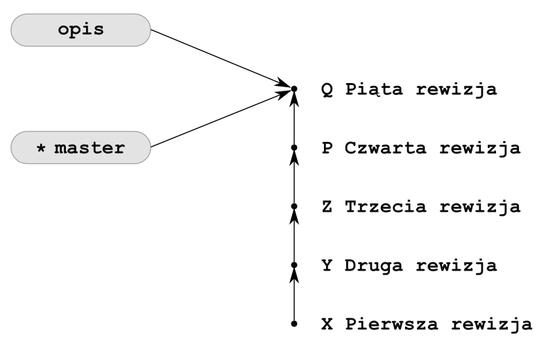
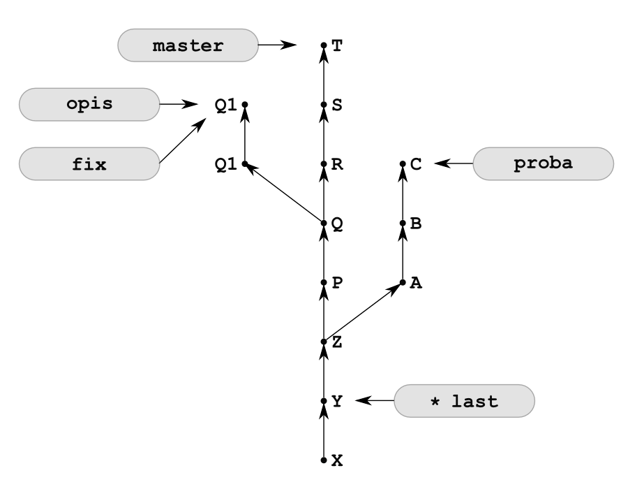

# Podstawy git — systemu kontroli wersji

Notatki z kursu Python w Future Collars

## Pierwsze repozytorium lokalne

```bash
git init<Enter>

Initialized empty Git repository in /home/robergo/ict/repozytorium/.git/
ls -a<Enter>
./ ../ .git/
```

Tworzymy pierwszy plik w katalogu roboczym:

```bash
touch pierwszy.txt
```

```bash
git status<Enter>
On branch main

No commits yet

Untracked files:
  (use "git add <file>..." to include in what will be committed)
# użyj „git add <file>…”, aby uwzględnić to, co zostanie zatwierdzone)
      pierwszy.txt

nothing added to commit but untracked files present (use "git add" to track)
# nic nie zostało dodane do zatwierdzenia, ale obecne są nieśledzone pliki
# (użyj „git add” do śledzenia)
```

Polecenie to informuje nas o obecnym statusie repozytorium, o gałęzi, na której się obecnie znajdujemy (zazwyczaj
master/main, bądź develop). W repozytorium nie ma jeszcze żadnych zarejestrowanych zmian (`no commits yet`), ale
`git` wykrył plik, który może być śledzony: pierwszy.txt. **Ten plik nie jest jeszcze przechowywany w repozytorium!**

## Commit — co to jest i jak na nim operować

`Commit` to najmniejsza paczka zmian rejestrowana w systemie `GIT`. Każdy `commit` ma swój identyfikator i napisany
przez człowieka komentarz.
Aby dodać `commit` z naszym pierwszym plikiem, należy wykonać najpierw polecenie:

```bash
  git add <nazwa pliku>
```

jeśli chcemy dodać wiele plików naraz:

```bash
  git add <nazwa pliku 1> <nazwa pliku 2> <nazwa pliku 3> ....
```

a następnie:

```bash
  git commit -m "<opis / komentarz do commit>"
```

dopiero wykonanie `git commit -m "..."` zapisuje nasze zmiany w repozytorium.

Dodajmy plik pierwszy.txt do repozytorium:

```bash
  git add pierwszy.txt
```

```bash
git commit -m "Added file pierwszy.txt"<Enter>
[main (root-commit) c64d4e3] Added file pierwszy.txt
 1 file changed, 1 insertion(+)
 create mode 100644 pierwszy.txt
```

`Git` poinformował nas, że dodał 1 plik do repozytorium. `Commit` dodał jedną linię (1 insertion(+)).

## GIT commit — dodawanie katalogów, modyfikacja, zmiana nazwy, usuwanie plików

Git porównuje wasze zmiany linia po linii w plikach tekstowych, tzn. jest w stanie wykryć zmiany (dodanie, usuwanie
całych linii).

W pliku pierwszy.txt dodaj następującą treść:

```txt
Lorem ipsum dolor sit amet, consectetur adipisicing elit.
Proin nibh augue, suscipit a, scelerisque sed, lacinia in, mi.
Cras vel lorem.
Etiam pellentesque aliquet tellus.
Phasellus pharetra nulla ac diam.
```

Sprawdźmy obecny stan:

```bash
git status<Enter>
On branch main
Changes not staged for commit:
# Zmiany nie przygotowane do zatwierdzenia:
  (use "git add <file>..." to update what will be committed)
  # (użyj „git add <file>…”, aby zaktualizować to, co zostanie zatwierdzone)
  (use "git restore <file>..." to discard changes in working directory)
  # (użyj „git restore <file>…”, aby odrzucić zmiany w katalogu roboczym)
        modified:   pierwszy.txt

no changes added to commit (use "git add" and/or "git commit -a")
# brak dodanych zmian do zatwierdzenia (użyj „git add” i/lub „git commit -a”)
```

Git poinformował nas o wykrytej zmianie w jednym pliku: pierwszy.txt.

Dodajmy nasze zmiany do repozytorium:

```bash
git add pierwszy.txt
```

```bash
git commit -m "Added four line to file"
[main b748719] Added four line to file
 1 file changed, 5 insertions(+), 1 deletion(-)
```

Git poinformował nas o dodaniu 5 linii. Mieliśmy dodać 4 linie. Usuńmy zatem środkową najkrótszą linię. Zmodyfikujmy
plik `pierwszy.txt`.

Dodajmy nasze zmiany do repo:

```bash
 git add pierwszy.txt
```

```bash
 git commit -m "Deleted one line"
[main 3327851] Deleted one line
 1 file changed, 1 deletion(-)
 ```

`Git` poinformował nas, że zmodyfikował plik, usuwając 1 linię. Błąd naprawiony.

Nasz plik `pierwszy.txt` nie opisuje adekwatnie tego, co się w nim znajduje. Zmieńmy jego nazwę w systemie
operacyjnym na `lorem-ipsum.txt`

Wykonajmy `git status`, żeby sprawdzić, jak ta akcja wpłynęła na nasze repozytorium:

```bash
git status
On branch main
Changes not staged for commit:
# Zmiany nie przygotowane do zatwierdzenia:
  (use "git add/rm <file>..." to update what will be committed)
  # (użyj „git add/rm <file>…”, aby zaktualizować to, co zostanie zatwierdzone)
  (use "git restore <file>..." to discard changes in working directory)
  # (użyj „git restore <file>…”, aby odrzucić zmiany w katalogu roboczym)
        deleted:    pierwszy.txt
  
Untracked files:
  (use "git add <file>..." to include in what will be committed)
        lorem-ipsum.txt
  # (użyj „git add <file>…”, aby uwzględnić to, co zostanie zatwierdzone)
no changes added to commit (use "git add" and/or "git commit -a")
# brak dodanych zmian do zatwierdzenia (użyj „git add” i/lub „git commit -a”)
```

`GIT` twierdzi, że usunęliśmy plik `pierwszy.txt` i utworzyliśmy nowy plik `lorem-ipsum.txt`. To nie do końca prawda.
Moglibyśmy dodać do `commita` zapis "usunięto plik pierwszy, dodano lorem-ipsum.txt", ale w ten sposób zgubilibyśmy
historię zmian pliku pierwszy — tzn. na podstawie `logu` nie bylibyśmy w stanie określić jasno, że wcześniej ten plik
miał inną nazwę.

Gdy zakomitujemy zmiany git poinformuje nas o dodanych liniach w pliku. Gdy zmienimy nazwę pliku, git będzie twierdził,
że usunęliśmy jeden plik,a dodaliśmy drugi. By zrobić to prawidłowo, cofnijmy zmianę nazwy: lorem-ipsum.txt ->
pierwszy.txt i wykonajmy polecenie `git mv (zmiana / przeniesienie pliku):`

```bash
git mv pierwszy.txt lorem-ipsum.txt
```

```bash
git status
On branch main
Changes to be committed:
# Zmiany do zatwierdzenia:
  (use "git restore --staged <file>..." to unstage)
  # (użyj „git reset HEAD <plik>…”, aby cofnąć z indexu
        renamed:    pierwszy.txt -> lorem-ipsum.txt
```

Tym razem `GIT` wie o zmianie nazwy — dodajmy w takim razie tę zmianę do commita:

W podobny sposób możemy jasno definiować usunięcie pliku:

```bash
git rm <nazwa pliku>
```

Co, gdy chcemy dodać cały katalog (razem ze znajdującymi się w nim plikami)? Tym samym poleceniem, co normalne dodawanie
plików git add. Nie musicie w takim przypadku dodawać każdego pliku w podkatalogu oddzielnie.

Utwórzmy podkatalog "podkatalog", a w nim dwa pliki a.txt b.txt (puste) i dodajmy samą nazwę podkatalogu:

```bash
mkdir podkatalog<Enter>
cd podkatalog<Enter>
touch a.txt b.txt<Enter>
cd ..<Enter>
git add podkatalog<Enter>
git commit -m "dodano podkatalog"
[master 92a1c03] dodano podkatalog
 2 files changed, 0 insertions(+), 0 deletions(-)
 create mode 100644 podkatalog/a.txt
 create mode 100644 podkatalog/b.txt
```

Jak widać, git dodał 2 pliki wewnątrz katalogu — co ważne, nie dodał bezpośrednio katalogu "podkatalog". Dzieje się tak
dlatego, że GIT nie śledzi samych podkatalogów, jedynie wnioskuje ich obecność na podstawie ścieżek plików. Dlatego nie
można do repozytorium dodać pustego katalogu!

# GIT — Przywracanie plików, usuwanie z listy do dodania (staging)

Co zrobić w momencie, gdy popełniliśmy błąd? Np. usunęliśmy przypadkowo plik, który był bardzo potrzebny, albo
dokonaliśmy w pliku zmian, które chcemy cofnąć. Rozwiązanie zależy od momentu, do którego chcemy się cofnąć.

Przydatne polecenia:

```bash
git checkout <nazwa pliku>
```

Powyższe polecenie `checkout` przywraca stan pliku, który jest zapisany w repozytorium ostatnim commitem.

```bash
git reset HEAD <nazwa pliku>
```

To polecenie usuwa zmiany w stagingu.

Przykład 2

Co, gdy przypadkowo usunęliśmy plik? (usunięcie nie zostało dodane do repozytorium) Usuńmy plik `lorem-ipsum.txt`.

```bash
git status
On branch main
Changes not staged for commit:
  (use "git add/rm <file>..." to update what will be committed)
  (use "git restore <file>..." to discard changes in working directory)
        deleted:    lorem-ipsum.txt

Untracked files:
  (use "git add <file>..." to include in what will be committed)
        niepotrzebny.txt

no changes added to commit (use "git add" and/or "git commit -a")
```

Aby przywrócić plik, wykonaj polecenie:

```bash
git checkout <nazwa pliku>
```

W naszym przypadku:

```bash
git checkout lorem-ipsum.txt<Enter>
Updated 1 path from the index
```

```bash
ls<Enter>
lorem-ipsum.txt  niepotrzebny.txt  podkatalog/
```

Przykład 3. Co, jeśli usunęliśmy plik, który był dodany do stagingu?

```bash
git rm lorem-ipsum.txt<Enter>
rm 'lorem-ipsum.txt'
```

```bash
git status 
On branch main
Changes to be committed:
  (use "git restore --staged <file>..." to unstage)
        deleted:    lorem-ipsum.txt
```

Tę zmianę cofamy w dwóch krokach:

```bash
git restore --staged lorem-ipsum.txt
```

```bash
git checkout lorem-ipsum.txt<Enter>
Updated 1 path from the index
```

Takie podejście można zastosować również do plików które niepotrzebnie zmieniliśmy (bez usuwania).

## GIT swobodna zmiana wersji, cofanie w czasie projektu, cofanie niektórych commitów.

Wykonajmy polecenie:

```bash
git log<Enter>
commit 3bbd5553ad2f7d6237577f0a659c0f786a921eed (HEAD -> main)
Author: Zenon Marek Raubuć <m.raubuc@wp.pl>
Date:   Wed Jan 25 18:16:34 2023 +0100

    Added file niepotrzebny.txt

commit 8c37a0f0aa2189876adecd397372448eb6926e14
Author: Zenon Marek Raubuć <m.raubuc@wp.pl>
Date:   Wed Jan 25 06:39:34 2023 +0100

    Added podkatalog

commit d96dce968c0aaa9070191c283e956792707b0dcc
Author: Zenon Marek Raubuć <m.raubuc@wp.pl>
Date:   Wed Jan 25 06:07:05 2023 +0100

    A better name for the first.txt file

commit 332785153f9e35f69e4406aa06ee98aba1906d4d
Author: Zenon Marek Raubuć <m.raubuc@wp.pl>
Date:   Wed Jan 25 04:26:23 2023 +0100

    Deleted one line

commit b748719e92d02b5adb0d5e1edc2f3498f11029eb
Author: Zenon Marek Raubuć <m.raubuc@wp.pl>
Date:   Wed Jan 25 04:21:57 2023 +0100

    Added four line to file

commit c64d4e3daedf8cc91a1be13dc0784100369eab0f
Author: Zenon Marek Raubuć <m.raubuc@wp.pl>
Date:   Wed Jan 25 03:56:11 2023 +0100

    Added file pierwszy.txt

(END)
```

To polecenie zwraca nam historię dotychczasowych commitów, w kolejności od najnowszego do najstarszego.

Przykład 1: chcemy wycofać jakąś starą zmianę, jednocześnie zachowując wszystkie przyszłe:

```bash
git revert <commit hash/ commit ID>
```

Ta linia 5 w pliku pierwszy by nam się jednak przydała — znajdujemy commit, który za to odpowiadał:

```bash
commit 332785153f9e35f69e4406aa06ee98aba1906d4d
Author: Zenon Marek Raubuć <m.raubuc@wp.pl>
Date:   Wed Jan 25 04:26:23 2023 +0100

    Deleted one line
```

Wykonujemy:

```bash
 git revert 332785153f9e35f69e4406aa06ee98aba1906d4d<Enter>
[main 52ebc01] Revert "Deleted one line"
 1 file changed, 1 insertion(+)
```

```bash
git log
commit 52ebc0127ea9fb2136c6ecceb156936078b35c60 (HEAD -> main)   
Author: Zenon Marek Raubuć <m.raubuc@wp.pl>
Date:   Wed Jan 25 18:37:31 2023 +0100

    Revert "Deleted one line"
    
    This reverts commit 332785153f9e35f69e4406aa06ee98aba1906d4d.

commit 3bbd5553ad2f7d6237577f0a659c0f786a921eed
Author: Zenon Marek Raubuć <m.raubuc@wp.pl>
Date:   Wed Jan 25 18:16:34 2023 +0100

    Added file niepotrzebny.txt

commit 8c37a0f0aa2189876adecd397372448eb6926e14
Author: Zenon Marek Raubuć <m.raubuc@wp.pl>
Date:   Wed Jan 25 06:39:34 2023 +0100

    Added podkatalog

commit d96dce968c0aaa9070191c283e956792707b0dcc
Author: Zenon Marek Raubuć <m.raubuc@wp.pl>
Date:   Wed Jan 25 06:07:05 2023 +0100

    A better name for the first.txt file
:
```

Git wstawił nowy commit, z informacją o cofnięciu wskazanych zmian. Co ciekawe, zmiana została cofnięta w nowym pliku "
lorem-ipsum" a nie w "pierwszy.txt". To dlatego, że prawidłowo daliśmy znać gitowi na późniejszym etapie, że zmieniliśmy
nazwę pliku — bardzo wygodne.

Przykład 2: Nie potrafimy namierzyć commitu, który wprowadził zmianę.

Możemy sprawdzić historię zmian w konkretnym pliku. poleceniem:

```bash
git log -p <nazwa pliku>
```

przykładowo:

```bash
$ git log -p lorem-ipsum.txt
commit 52ebc0127ea9fb2136c6ecceb156936078b35c60 (HEAD -> main)
Author: Zenon Marek Raubuć <m.raubuc@wp.pl>
Date:   Wed Jan 25 18:37:31 2023 +0100

    Revert "Deleted one line"

    This reverts commit 332785153f9e35f69e4406aa06ee98aba1906d4d.

diff --git a/lorem-ipsum.txt b/lorem-ipsum.txt
index 925e712..8ad9128 100644
--- a/lorem-ipsum.txt
+++ b/lorem-ipsum.txt
@@ -1,4 +1,5 @@
 Lorem ipsum dolor sit amet, consectetur adipisicing elit.
 Proin nibh augue, suscipit a, scelerisque sed, lacinia in, mi.
+Cras vel lorem. 
 Etiam pellentesque aliquet tellus.
 Phasellus pharetra nulla ac diam.

commit d96dce968c0aaa9070191c283e956792707b0dcc
Author: Zenon Marek Raubuć <m.raubuc@wp.pl>
Date:   Wed Jan 25 06:07:05 2023 +0100

    A better name for the first.txt file

diff --git a/lorem-ipsum.txt b/lorem-ipsum.txt
new file mode 100644
index 0000000..925e712
--- /dev/null
+++ b/lorem-ipsum.txt
@@ -0,0 +1,4 @@
+Lorem ipsum dolor sit amet, consectetur adipisicing elit. 
+Proin nibh augue, suscipit a, scelerisque sed, lacinia in, mi. 
+Etiam pellentesque aliquet tellus. 
+Phasellus pharetra nulla ac diam.
(END)
```

Po znalezieniu odpowiedniego commitu możemy wykonać:

```bash
git revert
```

Przykład 3 Co, jeśli chcemy po prostu cofnąć się w czasie do konkretnego commitu?

```bash
git checkout <commit ID/ Hash>
```

> **Uwaga**: to podejście polega na pracy z tzw. `detached HEAD`. Oznacza to, że wasze zmiany nie są już zapisywane w
> domyślnej gałęzi master (dlatego, że ścieżka się już rozdzieliła).

# GIT gałęzie

Notatki z kursu Python

## Co to są gałęzie:

Do tej pory, gdy tworzyliśmy nasze pliki, ciąg akcji podejmowanych przez commity wyglądał mniej więcej tak:

```txt
master: A -> B -> C -> D -> E -> F
# Każda litera to oddzielny kommit
```

Układ był jak najbardziej liniowy. Bardzo rzadko w przypadku kodu, nad którym pracuje wiele osób, ma to miejsce.
Utworzenie `brancha` od commitu `F` w gałęzi master i dodanie różnych commitów będzie wyglądać mniej więcej tak:

```txt
master: A -> B -> C -> D -> E -> F
feature e: A -> B -> C -> D -> E -> F -> G -> H -> I
feature a: A -> B -> C -> D -> E -> F -> J -> K -> L
```

W pewnym momencie możemy spróbować je połączyć ze sobą, by znów mieć stabilną jednolitą gałąź master:

```txt
master: A -> B -> C -> D -> E -> F -> G -> H -> J -> K -> L -> I
```

Kod w bazowej gałęzi powinien być zawsze stabilny. To może być problematyczne w przypadku częstych małych commitów. Do
tego możemy wysłać commita tylko do czubka gałęzi, co znaczy, że programista musiałby nieustannie aktualizować swoje
repozytorium, by móc zapisywać zmiany zdalne.

Do tej pory pracowaliśmy na jednej gałęzi. Nazywała się "master". W repozytoriach firmowych domyślną gałęzią jest
master/main bądź develop.
Jako Master/Main przyjmuje się zwykle gałąź reprezentującą Kod w wersji produkcyjnej.
Develop to zwykle wersja od developerów już łącząca wyniki wszystkich programistów, ale jeszcze nie
przetestowana/przyjęta jako obecnie stabilna.
Należy pamiętać, że to rozróżnienie jest przyjętą koncepcją i może (zazwyczaj nie) różnić się między firmami.

## Po co nam są w ogóle gałęzie?

Cofnijmy się do przykładu pierwszego z Ewą i Adamem.
Rozbudową, nad którą pracuje Ewa, niech będzie się nazywać feature-e.
Naprawa, nad którą pracuje Adam: feature-a.
W naszym przykładzie Ewa powinna utworzyć nową gałąź o nazwie feature-e, a Adam gałąź o nazwie feature -a

Po zakończeniu pracy najpierw Ewa łączy swoją gałąź z gałęzią główną, wszystko przebiega pomyślnie.
Gałąź master przed połączeniem zmian wygląda tak:

master: A -> B -> C -> D -> E -> F

po połączeniu gałęzi Ewy:

master: A -> B -> C -> D -> E -> F -> G -> H -> I

Pora na Adama, skończył pracę później, próbuje połączyć rezultaty pracy. W większości poszło dobrze, ale jest też jedna
linia, którą i Adam i Ewa zmienili. Adam musi zmienić swój kod tak, by działał poprawnie, po zatwierdzeniu wysyła
specjalnego commita łączącego obie gałęzie (M).
gałąź po działaniu Adama:

master: A -> B -> C -> D -> E -> F -> G -> H -> I -> J -> K -> L -> M

Jak widać, problem został rozwiązany, wyniki pracy zarówno Ewy jak i Adama znajdują się w repozytorium.

## Tworzenie i praca z gałęziami

Aby sprawdzić dostępne gałęzie, wykonujemy polecenie:

```bash
git branch
```

```bash
git branch<Enter>
* main
```

Jak widać, dostępna jest tylko jedna gałąź "master". Gwiazdka przy nazwie oznacza, że jest to obecnie aktywna gałąź.
Aby utworzyć nową gałąź, wykonujemy polecenie:

```bash
git checkout -b <nazwa gałęzi>
```

Nowa gałąź będzie zawsze zawierać wszystkie commity z gałęzi bazowej. Gałąź bazowa to ta, która była aktywna tuż przed
wykonaniem git checkout -b, ostatnim commitem będzie ten, na który wskazuje HEAD.

Na przykładzie z lekcji pierwszej, utwórzmy gałąź "dalsza-rozbudowa" (nazwa gałęzi nie może zawierać spacji),

```bash
git checkout -b dalsza-rozbudowa<Enter>
Switched to a new branch dalsza-rozbudowa
```

Jak widać, polecenie checkout -b nie tylko tworzy nową gałąź, ale też od razu na nią przełącza. Możemy to potwierdzić
przez wywołanie polecenia `git branch`

```bash
git branch<Enter>
* dalsza-rozbudowa
 main
```

Aby przełączyć się na jedną z dostępnych gałęzi, wykonaj polecenie:

```bash
git checkout <nazwa gałęzi>
```

Używając naszego testowego repozytorium, przełączmy się na gałąź master. Wrócimy zaraz potem do naszej gałęzi "
dalsza-rozbudowa". Zwróć uwagę na brak parametru -b.git

```bash
git checkout master<Enter>
Switched to branch 'master'

git branch<Enter>
 dalsza-rozbudowa
*  master

git checkout dalsza-rozbudowa<Enter>
Switched to a new branch 'dalsza-rozbudowa'
```

Commity są dodawane tylko do gałęzi, w której obecnie pracujemy. Na potwierdzenie na podstawie naszego testowego
repozytorium utwórz plik podkatalog/c.txt i dodaj go do repozytorium.

```bash
git add podkatalog/c.txt 
git commit -m "dodaj plik c.txt"
[dalsza-rozbudowa a35f8e6] dodaj plik c.txt
 1 file changed, 0 insertions(+), 0 deletions(-)
 create mode 100644 podkatalog/c.txt
```

```bash
git log
commit 4fc098a308ed1c334a316dcd941be692a93c3ab2 (HEAD -> dalsza-rozbudowa)
Author: Zenon Marek Raubuć <m.raubuc@wp.pl>
Date:   Wed Jan 25 22:08:07 2023 +0100

    Added file c.txt

commit 52ebc0127ea9fb2136c6ecceb156936078b35c60 (main)
Author: Zenon Marek Raubuć <m.raubuc@wp.pl>
Date:   Wed Jan 25 18:37:31 2023 +0100

    Revert "Deleted one line"

    This reverts commit 332785153f9e35f69e4406aa06ee98aba1906d4d.

commit 3bbd5553ad2f7d6237577f0a659c0f786a921eed
Author: Zenon Marek Raubuć <m.raubuc@wp.pl>
Date:   Wed Jan 25 18:16:34 2023 +0100

    Added file niepotrzebny.txt

commit 8c37a0f0aa2189876adecd397372448eb6926e14
Author: Zenon Marek Raubuć <m.raubuc@wp.pl>
Date:   Wed Jan 25 06:39:34 2023 +0100

    Added podkatalog
```

Jak widać, commit "dodaj plik c.txt jest obecny. Sprawdźmy, czy jest dostępny w gałęzi "master":

```bash
$ git checkout main
Switched to branch 'main'
```

```bash
git log
commit 52ebc0127ea9fb2136c6ecceb156936078b35c60 (HEAD -> main)
Author: Zenon Marek Raubuć <m.raubuc@wp.pl>
Date:   Wed Jan 25 18:37:31 2023 +0100

    Revert "Deleted one line"

    This reverts commit 332785153f9e35f69e4406aa06ee98aba1906d4d.

commit 3bbd5553ad2f7d6237577f0a659c0f786a921eed
Author: Zenon Marek Raubuć <m.raubuc@wp.pl>
Date:   Wed Jan 25 18:16:34 2023 +0100

    Added file niepotrzebny.txt

commit 8c37a0f0aa2189876adecd397372448eb6926e14
Author: Zenon Marek Raubuć <m.raubuc@wp.pl>
Date:   Wed Jan 25 06:39:34 2023 +0100

    Added podkatalog

commit d96dce968c0aaa9070191c283e956792707b0dcc
Author: Zenon Marek Raubuć <m.raubuc@wp.pl>
Date:   Wed Jan 25 06:07:05 2023 +0100

    A better name for the first.txt file
:
```

Ostatni commit jest dostępny tylko w gałęzi "dalsza-praca", zgodnie z założeniem.

## Łączenie gałęzi

Pracę po pewnym czasie trzeba połączyć tak, by uzyskać stabilną wersję główną. `GIT` jest w stanie połączyć
automatycznie
gałęzie, jeśli pracujemy na różnych plikach. W przypadku pracy na tych samych plikach `GIT` jest je w stanie połączyć,
gdy
zmieniane linie nie nakładają się.

Do łączenia gałęzi służy polecenie:

```bash
git merge <nazwa gałęzi>
```

hint na przyszłość, spróbuj użyć polecenia:

```bash
git mergetool
```

## Kiedy Git nie jest w stanie rozwiązać konfliktu?

# II. Repozytoria z rozgałęzieniami

Notatki z książki ...

## Tworzenie i usuwanie gałęzi

> Rozważania zawarte w części II dotyczą pojedynczego repozytorium. Gałęzie zawarte w repozytorium, w którym pracujemy,
> określamy przymiotnikiem „lokalne”.

### Gałęzie to wskaźniki rewizji

Git optymalizuje zarządzanie pod kątem obsługi gałęzi. **Gałęzie Gita są wskaźnikami rewizji**. Tworzenie i usuwanie
gałęzi sprowadza się do operowania skrótami `SHA-1`. Utworzenie gałęzi to utworzenie pliku tekstowego zawierającego
skrót `SHA-1.`

### Gałąź master

Domyślnie w nowym repozytorium utworzonym poleceniem:

```bash
git init

```

po wykonaniu pierwszej rewizji tworzona jest jedna gałąź o nazwie master. Wydając polecenie:

```bash
git branch
```

Wydruk będzie zawierał informację:

```bash
* master
```

Gwiazdka informuje, że jest to gałąź, na której się obecnie znajdujemy.

Rewizje dodajemy poleceniami:

```bash
git add -A
git commit –m "Pierwsza rewizja"

```

Polecenie:

```bash
git status –sb

```

wyświetla skróconą informację o plikach repozytorium oraz nazwę gałęzi bieżącej.

Za każdym razem, gdy tworzymy rewizję, wskaźnik bieżącej gałęzi jest przesuwany do ostatniej utworzonej rewizji. Po
dodaniu kolejnych rewizji repozytorium będzie wyglądało tak jak na rysunku:


Rys. Repozytorium po wykonaniu pięciu rewizji.

Wskaźnik master to skrót `SHA-1` wskazywanej rewizji. Jest on zapisywany w pliku `.git/refs/heads/master`.
Plik `.git/refs/heads/master` dla repozytorium z rysunku będzie zawierał tekst Q.

> Na rysunku litery X, Y, Z, P oraz Q symbolizują skróty `SHA-1` rewizji.

### Tworzenie gałęzi

Do tworzenia gałęzi służy polecenie:

```bash
git branch name-new-branch
```

Jeśli w repozytorium z rysunku powyżej wydamy komendę:

```bash
git branch opis
```

spowoduje ona utworzenie nowej gałęzi o nazwie `opis`. Repozytorium będzie teraz wyglądało tak jak na rysunku poniżej



W folderze `.git` pojawi się plik `.git/refs/heads/opis` zawierający wartość `SHA-1` rewizji piątej.

Sprawdźmy gałęzie repozytorium. Polecenie:

```bash
git branch
```

zwróci tym razem wydruk:

```bash
* master
  opis
```

W repozytorium znajdują się dwie gałęzie. Bieżącą gałęzią jest gałąź `master`. Informacja o bieżącej gałęzi jest
zapisywana w pliku `.git/HEAD`. Jeśli bieżącą gałęzią jest gałąź `master`, to w pliku `HEAD` znajdziemy wpis:

```text
ref: refs/heads/master
```

### Dodawanie rewizji w bieżącej gałęzi

Jeśli teraz utworzymy nową rewizję. Gałąź bieżąca, czyli `master`, zostanie przesunięta na dodaną rewizję, a
gałąź `opis` pozostanie niezmieniona. Nowe rewizje są automatycznie dodawane do bieżącej gałęzi, w tym przypadku
do `master`.


### Tworzenie gałęzi wskazujących dowolną rewizję

Gałęzie możemy tworzyć, wskazując dowolną rewizję:

```bash
git branch nazwa-galezi SHA-1
```

Np.:

```bash
git branch proba Z
```


W folderze `.git` pojawi się plik `.git/refs/heads/proba` zawierający wartość `SHA-1` rewizji oznaczonej na rysunku
symbolem `Z`. Gałąź bieżąca nie ulegnie zmianie:

```bash
git branch
```

Wydruk będzie następujący:

```text
* master
  opis
  proba
```

Porządek gałęzi na powyższym wydruku jest alfabetyczny.

### Przełączanie gałęzi

Do zmiany gałęzi bieżącej służy komenda:

```bash
git checkout nazwa-galezi
```

Po wydaniu tej komendy bieżącą gałęzią stanie się gałąź o podanej nazwie, a pliki w obszarze roboczym przyjmą postać z
ostatniej rewizji w tej gałęzi.

> W początkowym okresie nauki komendę przełączania gałęzi najlepiej wydawać wyłącznie wtedy, gdy wszystkie pliki są
> aktualne (tj. gdy polecenie `git status –s` zwraca pusty wynik).

Po wydaniu komendy:

```bash
git checkout proba
```

pliki obszaru roboczego będą odpowiadały stanowi z rewizji `Z`. Ponadto polecenie:

```bash
git branch
```

zwróci wydruk:

```text
  master
  opis
* proba
```

Gwiazdka przy gałęzi `proba` informuje, że jest to gałąź bieżąca. W pliku `.git/HEAD` znajdziemy wpis:

```text
ref: refs/heads/proba
```


Wszystkie następne rewizje trafią do gałęzi `proba`:


Przejdźmy na gałąź `opis`:

```bash
git checkout opis
```

i dodajmy rewizje Q1 i Q2.


### Tworzenie i przełączanie gałęzi

Operację tworzenia i przełączania gałęzi możemy wykonać jednym poleceniem:

```bash
git checkout –b nazwa-galezi
```

Jeśli w repozytorium w stanie z rysunku powyżej wydamy komendę:

```bash
git checkout –b fix
```

to w repozytorium pojawi się gałąź `fix` i będzie to gałąź bieżąca.


Nowo utworzona gałąź może wskazywać dowolną rewizję. Służy do tego polecenie:

```bash
git checkout –b nazwa-galezi SHA-1
```

W celu utworzenia gałęzi last wskazującej rewizję Y należy wydać komendę:

```bash
git checkout –b last Y
```



### Stan detached HEAD

Jeśli pliki z obszaru roboczego przywrócimy do stanu z konkretnej rewizji, posługując się jej skrótem `SHA-1`,

```bash
git checkout SHA-1
```

wówczas repozytorium będzie znajdowało się w stanie określanym w dokumentacji terminem _detached HEAD_. W tym momencie
żadna gałąź nie jest gałęzią bieżącą. W pliku `.git/HEAD` zapisany jest skrót `SHA-1` konkretnej rewizji, a nie nazwa
symboliczna gałęzi `(np. ref: refs/heads/master).`

Jeśli w repozytorium z rysunku powyżej wydamy komendę:

```bash
git checkout A
```

wówczas repozytorium przyjmie stan z rysunku:


Zwróć uwagę na brak gwiazdki na rysunku.

Pliki w obszarze roboczym będą odpowiadały rewizji `A`, a w pliku `.git/HEAD` zapisany będzie skrót `SHA-1` rewizji `A`.

Polecenie:

```bash
git branch
```

zwróci wynik:

```text
* (no branch)
  fix
  last
  master
  opis
  proba
```

W takim stanie najlepiej nie wprowadzać żadnych modyfikacji w repozytorium (tj. nie tworzyć nowych rewizji), gdyż można
je utracić.

Co się stanie, jeśli wykonamy nową rewizję? W repozytorium pojawi się rewizja, do której nie można dotrzeć, stosując
gałąź. Rewizja ta zostanie dodana jako dziecko rewizji wskazanej przez `HEAD`. Jeśli w repozytorium z rysunku 13.13
wykonamy nową rewizję D, postać repozytorium będzie taka jak na rysunku 13.14.
